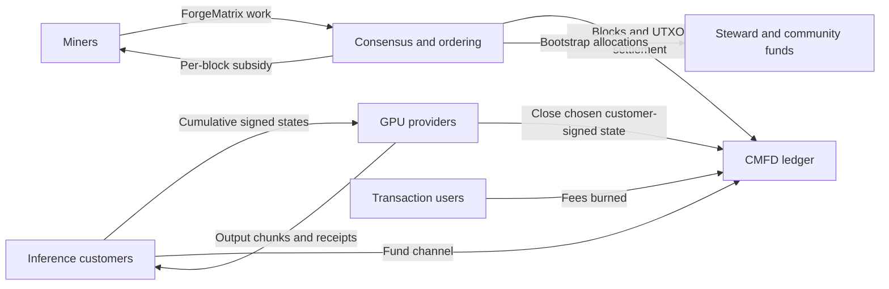
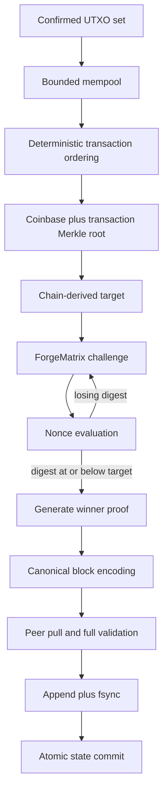
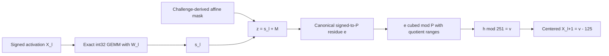
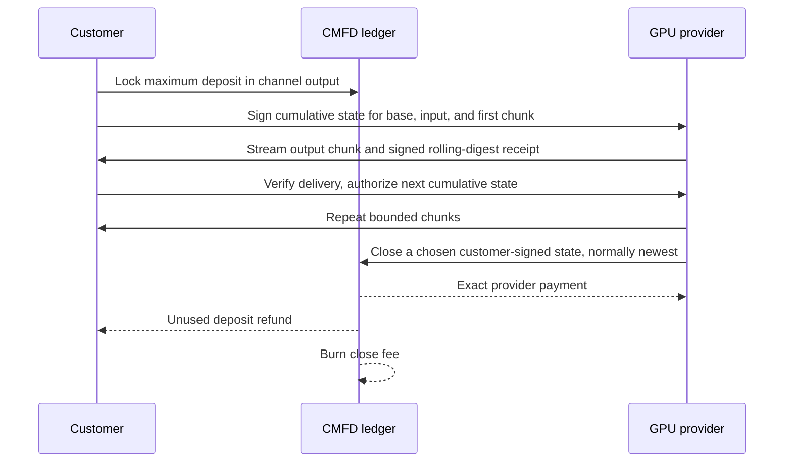

# Common Foundry

## Matrix-Bound Proof of Work and Direct GPU Inference Markets

Technical White Paper - ProductionV4 Testnet-1 and ForgeMatrix v2 Research Architecture

Version 0.2 - August 2026

Common Foundry Research

> **ProductionV4 Testnet-1 milestone.** Common Foundry `v0.1.0-devnet.16` runs the full 128 by 4,096 by 384 ForgeMatrix profile with a transparent BaseFold proof. ProductionV4 blocks have been created, CPU-verified, accepted through normal P2P admission, and independently downloaded and persisted by another node. The testnet and its coins are for research and testing.

---

## Abstract

Common Foundry is a research architecture for a proposed permissionless proof-of-work ledger that coordinates GPU computation. It separates two activities that are often conflated in claims about "useful proof of work." First, a deterministic, public, matrix-heavy function called ForgeMatrix orders blocks and secures settlement. Second, the proposed market would let customers purchase actual inference directly from GPU providers through prepaid, progressively authorized payment channels denominated in CMFD. The mining function is not customer inference, and an inference receipt is not a proof that a model answer is correct. This separation is intentional: consensus must remain deterministic, self-contained, and independently verifiable, while commercial inference is heterogeneous, latency-sensitive, and frequently private.

ForgeMatrix v2 uses signed INT8 by signed INT8 matrix multiplication with exact INT32 accumulation over a seedless committed 6 GiB weight bank. Its ProductionV4 profile evaluates 384 sequential 4,096 by 4,096 layers over a batch of 128 rows, totaling 824,633,720,832 multiply-accumulate operations per nonce. A block-specific affine mask and a range-bound cubic transition over the prime 134,217,689 prevent the earlier small-modulus accumulator shortcut. The transparent proof binds the computation, model artifacts, block challenge, winning nonce, target, and final activation digest. Nodes verify that proof independently instead of trusting the miner or repeating the full matrix computation.

The software now contains that full-shape proof as an isolated ProductionV4 testnet profile. The complete canonical proof measured 12,025,320 bytes. On an RTX 5090, the measured online proof was 6.093 seconds after 0.471 seconds of replay and before 0.311 seconds of mandatory CPU self-verification. A physical RTX 5070 Ti with 16 GB of VRAM also produced and CPU-verified the exact proof in a 74.294-second complete three-process path. These measurements provide two named hardware baselines for continued optimization.

This revision records a deliberate proof-system advance. ProductionV3 supplied a complete BLS12-381 correctness reference and measured the work involved in transition scoring and scratch I/O. ProductionV4 applies those lessons through a KoalaBear-native GPU BaseFold proof, bringing the RTX 5090 online proof to 6.093 seconds while preserving artifact authentication, range checks, statement binding, proof verification, and the mandatory CPU self-check of every candidate.

The monetary policy has a five-year, per-block linear bootstrap emission followed by a permanent 5 CMFD miner tail. During the bootstrap, each subsidy is split 70% to miners, 25% to a steward destination, and 5% to a community destination. All transaction and inference-channel close fees are burned. The steward and community outputs are transparent and immediately spendable on a per-block basis. After the bootstrap, the 5 CMFD tail is paid only to miners.

The objective is to make the protocol precise, executable, measurable, and ready for broad public testing through clear engineering milestones.

## 1. ProductionV4 scope and milestones

This paper uses the following labels as protocol terms:

| Label | Meaning |
|---|---|
| **Implemented** | Enforced by the current Rust consensus or node code and covered by executable tests. |
| **Devnet reference** | Operational on a research network for protocol, hardware, wallet, and operator testing. |
| **Production proposal** | Specified research design for a future consensus profile. |
| **Activation milestone** | A measurable achievement on the path from testnet to a public-value profile. |

This revision describes `v0.1.0-devnet.16`, an isolated ProductionV4 testnet that is incompatible with ProductionV3 Devnet-15. ProductionV4 uses separate network identity, ports, storage, artifact pins, proof tag, and network-specific frame limits. Windows and Linux releases include standalone node, GUI wallet, and GPU miner packages. The original tiny Devnet and the ProductionV3/Dory work remain useful research history, but they no longer describe the active proof path.

### 1.1 ProductionV4 decision summary

| Engineering goal | ProductionV4 choice | Benefit |
|---|---|---|
| Deliver the full proof inside a practical mining cycle. | Use a KoalaBear-native GPU BaseFold proof. | The measured RTX 5090 online proof is 6.093 seconds. |
| Keep the complete 384-layer ForgeMatrix workload. | Change the proof system while preserving the committed computation and final output. | The network retains its matrix-bound work profile while gaining a much faster proof. |
| Carry the measured 12,025,320-byte proof safely. | Use a ProductionV4-only 13 MiB proof frame and 16 MiB block frame. | The proof, coinbase, transactions, and framing fit with explicit headroom; older networks keep their original limits. |
| Combine GPU speed with independent correctness. | Require CPU self-verification before submission and independent node verification on admission. | Performance and consensus assurance remain separate responsibilities. |
| Keep mining accessible to consumer GPU operators. | Qualify both RTX 5090 and a physical RTX 5070 Ti 16 GB. | The proof fits a named 16 GB consumer card as well as the fastest qualified card. |
| Make testing straightforward. | Ship Windows and Linux node, GUI wallet, and miner packages with authenticated resumable downloads and compact statistics. | Testers can launch, monitor, and troubleshoot the full network path with consistent artifacts. |

### 1.2 Parameter rationale at a glance

| Parameter | Chosen value | Positive design reason |
|---|---:|---|
| Target block interval | 60 seconds | Keeps feedback and settlement responsive while giving miners time to build and relay a full proof. |
| Difficulty window | Up to 180 blocks | Uses roughly three hours of one-minute history to smooth short bursts while still following sustained hash-rate changes. |
| Coinbase maturity | 100 blocks | Gives the chain time to settle before newly mined rewards become spendable. |
| Bootstrap rewards | 70% miner / 25% steward / 5% community | Funds mining, continuing engineering, and community growth transparently in every bootstrap block. |
| Permanent tail | 5 CMFD, miners only | Maintains a predictable long-run proof-of-work security budget after the other bootstrap allocations end. |
| ForgeMatrix shape | 128 by 4,096 by 384 | Creates a substantial, sequential matrix workload aligned with modern GPU capabilities. |
| Seedless model bank | Approximately 6.4 GB packaged | Makes the authenticated model a meaningful shared resource instead of a short regenerable seed. |
| ProductionV4 proof / block frames | 13 MiB / 16 MiB | Carries the measured transparent proof with room for normal block framing and transactions. |
| Hardware accessibility target | Named 16 GB GPUs | Keeps the reference proving path within a widely available consumer memory tier. |
| CPU self-verification | Mandatory for every candidate | Gives miners an independent correctness check before spending bandwidth on submission. |

This white paper describes the intended system, the rationale behind its choices, the exact consensus relations already specified, and the milestones ahead. ProductionV4 Testnet-1 and its coins are for research and testing.

## 2. Why Common Foundry is needed

### 2.1 Three coordination problems

Modern GPU operators face three distinct coordination problems:

1. **Permissionless settlement needs an objective ordering rule.** A ledger needs a public predicate that every validator can evaluate identically without relying on a customer, cloud provider, model vendor, or external oracle.
2. **Inference providers need low-friction incremental payment.** Model execution is often streamed, usage-metered, and too granular for an on-chain transaction per token chunk. Neither party should need to extend unlimited credit.
3. **A new protocol needs visible, continuing infrastructure funding.** Engineering, audits, ecosystem tools, and operator support require resources, but hidden premines and discretionary inflation weaken credibility.

Common Foundry gives each problem the mechanism best suited to it. Consensus uses one public, deterministic matrix relation that every node can verify identically. The inference market remains free to support private inputs, varied models, evolving runtimes, and demand-driven scheduling. Infrastructure funding is expressed directly in the visible block-reward schedule.

Common Foundry therefore separates the responsibilities.



### 2.2 The central thesis

Common Foundry is a research-first attempt to align permissionless monetary security, GPU matrix computation, direct inference payments, and transparent public-goods funding through rules that every node can reproduce.

The intended alignment is economic rather than magical:

- ForgeMatrix makes large exact matrix multiplication the dominant candidate cost.
- That work favors hardware and operational skills also useful for machine learning.
- The same operators may separately sell inference.
- The chain supplies neutral asset settlement and bounded-exposure channels.
- Steward and community allocations are explicit in every bootstrap coinbase.

Mining and customer inference are complementary but separate activities. Consensus advances independently of customer demand, while the marketplace can evolve its models, privacy terms, and service runtimes without changing block validity.

### 2.3 Why matrix-bound work

ForgeMatrix chooses a distinct hardware-cost shape: a large public data set, repeated dense matrix reuse, exact arithmetic, and sequential nonlinear transitions.

The benefit is a mining ecosystem aligned with commodity ML acceleration rather than a narrow hash-only pipeline. ProductionV4 combines that workload with a transparent proof, a fixed authenticated model artifact, exact cross-platform semantics, bounded parsers, and named hardware measurements. This makes the design an empirical, measurable GPU-work protocol.

## 3. System architecture

Common Foundry consists of four layers:

1. **Consensus library.** Canonical transactions and blocks, UTXO state transitions, reward allocation, fee burning, difficulty, proof selection, and wire encoding.
2. **ForgeMatrix proof-of-work.** A public, block-bound computation and its proposed succinct proof.
3. **Inference payment protocol.** Signed cumulative customer authorizations, provider receipts, and on-chain settlement or refund.
4. **Node and wallet runtime.** Static private peer synchronization, forks, persistence, mempool, mining templates, loopback RPC, a CMFD-specific Devnet pool service, and a Devnet wallet interface.

The crates separate responsibilities for review. Consensus explicitly imports the marketplace types and rules that govern channel spends, while the node consumes canonical consensus objects; this is an audit boundary, not cryptographic or dependency isolation. Any marketplace function reached from consensus is consensus-critical and must be versioned, reviewed, and tested with the same discipline as the ledger rules.

### 3.1 End-to-end block path



The block challenge includes the network, model, parent, transaction root, height, timestamp, target, and nonce. A miner cannot change the reward outputs or ordinary transactions after finding work because the coinbase commitment and transaction identifiers are included in the Merkle root.

## 4. Ledger and consensus core

### 4.1 UTXO state

Common Foundry uses an unspent transaction output model. Each input names a prior transaction identifier and output index. Ordinary key-locked outputs are controlled by a 32-byte x-only secp256k1 public key and a 64-byte Schnorr signature. Inference-channel outputs use a distinct structured lock enforced by consensus.

Every transaction commits to the full 32-byte network identifier. Signatures and identifiers use domain-separated hashing so an object valid on one network cannot be replayed on another network with merely a colliding four-byte wire magic.

Validation enforces:

- the expected transaction and block versions;
- exact network identity;
- canonical bounded encoding;
- unique inputs and available UTXOs;
- signature validity and lock semantics;
- coinbase maturity;
- nonzero outputs and no value creation;
- transaction, input, output, byte, and signature-count caps;
- exact channel settlement or timeout-refund accounting.

### 4.2 Coinbase and maturity

Every bootstrap block creates exactly three consensus outputs:

1. the miner reward;
2. the steward award;
3. the community award.

The miner output matures after 100 blocks. Steward and community outputs are marked spendable at their creation height; because transactions are validated before the current block's coinbase is inserted, they can first be consumed by a later block. There is no 90-day delay.

The destinations and reward rules are immutable network parameters committed into the consensus fingerprint. A node cannot accept a different community key, monetary schedule, proof profile, or resource limit while claiming compatibility with the same fingerprint.

### 4.3 Canonical wire format

Top-level transactions, proofs, and blocks use a fixed 16-byte frame header:

```text
offset  size  field
0       4     ASCII "CMFD"
4       4     network-derived magic
8       2     little-endian wire version
10      1     object kind
11      1     flags, currently zero
12      4     little-endian payload length
```

The decoder rejects unknown tags or kinds, nonzero flags, excessive counts or lengths, truncation, malformed fixed-width fields, noncanonical nested encodings, and trailing bytes. Consensus validation separately rejects duplicate transaction inputs and duplicate or retired channel identifiers. Current upper bounds are:

| Resource | Bound |
|---|---:|
| Block frame, networks before ProductionV4 | 1 MiB |
| Block frame, ProductionV4 Testnet-1 only | 16 MiB |
| Transaction frame | 64 KiB |
| Proof frame, tags before ProductionV4 | 256 KiB |
| Proof frame, ProductionV4 Testnet-1 only | 13 MiB |
| Transactions per block | 1,024 |
| Inputs per transaction | 128 |
| Outputs per transaction | 128 |
| Aggregate regular inputs per block | 4,096 |
| Aggregate regular outputs per block | 4,096 |
| Signature checks per block | 2,048 |
| Coinbase outputs | 3 |

These are consensus and parser-safety choices, not throughput claims. Fixed-width little-endian fields and explicit count caps were chosen over general-purpose serialization because consensus must reject ambiguous representations and allocate only after checking declared sizes.

### 4.4 Difficulty adjustment

The target interval is 60 seconds. The next target uses at most the most recent 180 header-work records. Let `Nw` be the number of records in the window, `T_i` the encoded targets, and `t_i` the effective timestamps. For `Nw > 1`:

```text
average_target = floor(sum(T_i) / Nw)
expected_span  = (Nw - 1) * 60
actual_span    = clamp(t_last - t_first,
                       expected_span / 3,
                       3 * expected_span)
next_target    = min(pow_limit,
                     max(1,
                         floor(average_target * actual_span /
                               expected_span)))
```

The block must carry exactly this independently derived target before proof verification. Arithmetic uses checked 256- and 512-bit integers.

Raw timestamps must exceed the median of the preceding 11 timestamps and must not be more than 24 hours beyond the validating node's locally supplied acceptance time. Effective median timestamps, rather than raw miner timestamps, enter the retarget history. This reduces timestamp manipulation, although it still requires reasonably synchronized operator clocks.

### 4.5 Chainwork and fork choice

The work assigned to a target `T` is:

```text
work(T) = floor(2^256 / (T + 1))
```

Cumulative work is stored in 512 bits. A side branch activates only when its fully validated cumulative work is **strictly greater** than the active branch. Equal-work branches retain the existing active tip. There is no finality rule; the system inherits Nakamoto-style majority-work assumptions and reorganization risk.

## 5. Monetary policy and funding

### 5.1 Units and five-year bootstrap

One CMFD contains 100,000,000 atomic units. With a nominal 60-second block target, five 365-day years contain:

```text
N = 5 * 365 * 24 * 60 = 2,628,000 blocks
```

The initial subsidy is 500 CMFD. For real block height `h`, where `1 <= h <= N`:

```text
R(h) = floor(50,000,000,000 * (N - h + 1) / N) atoms
```

At height `N + 1` and thereafter, the subsidy is a permanent miner-only 5 CMFD tail.

| Height | Total subsidy | Miner | Steward | Community |
|---:|---:|---:|---:|---:|
| 1 | 500.00000000 | 350.00000000 | 125.00000000 | 25.00000000 |
| 525,600 | 400.00019025 | 280.00013318 | 100.00004756 | 20.00000951 |
| 1,314,000 | 250.00019025 | 175.00013318 | 62.50004756 | 12.50000951 |
| 2,628,000 | 0.00019025 | 0.00013318 | 0.00004756 | 0.00000951 |
| 2,628,001 | 5.00000000 | 5.00000000 | 0 | 0 |

The 5 CMFD tail begins by design after the final bootstrap block, establishing the permanent miner-only security budget.

<!-- PDF_FIGURE:emission -->

### 5.2 Per-block allocation

During the bootstrap:

```text
steward   = floor(R(h) * 25 / 100)
community = floor(R(h) *  5 / 100)
miner     = R(h) - steward - community
```

Rounding remainder belongs to the miner so the three outputs sum exactly to the scheduled subsidy. Once the tail begins, the entire 5 CMFD goes to the miner and both public-goods streams stop.

The exact aggregate bootstrap issuance is:

```text
E_bootstrap = sum from k=1 to N of floor(R0 * k / N)

      = (R0*N + R0 - N + gcd(R0,N)) / 2

      = 65,700,024,998,688,000 atoms
      = 657,000,249.98688000 CMFD
```

Its implemented aggregate distribution is:

| Recipient | Bootstrap CMFD |
|---|---:|
| Miners | 459,900,175.01312000 |
| Steward | 164,250,062.48688000 |
| Community | 32,850,012.48688000 |
| Steward plus community | 197,100,074.97376000 |
| Total | 657,000,249.98688000 |

The permanent tail gives supply an open-ended, fully specified schedule. At height `H >= N + 1`:

```text
gross_issuance(H)
  = 657,000,249.98688
    + 5 * (H - 2,628,000) CMFD
```

At target spacing the tail adds 2,628,000 CMFD per 365-day year. The first tail year's gross inflation is about 0.4% of bootstrap issuance and declines proportionally as the base grows. Protocol-tracked unburned supply equals gross issuance minus burned fees. Outputs controlled by lost keys remain outstanding in ledger accounting even though they are economically inaccessible.

### 5.3 Why the bootstrap declines linearly

A linear per-block decline avoids discrete halving cliffs. It makes the schedule transparent at every height and reduces recurring moments where miner revenue changes abruptly by 50%. Height, rather than timestamp, controls the reward, so miners cannot directly accelerate issuance by selecting timestamps.

The five-year bootstrap supplies the strongest rewards while the network is building participation. Because the schedule is height-based, every node derives the same subsidy without depending on wall-clock estimates.

### 5.4 Why the tail is permanent and miner-only

All fees are burned, so the permanent 5 CMFD tail provides miners with a simple, predictable long-run security budget. Paying the tail only to miners keeps the post-bootstrap rule clear: the steward and community allocations finish with the bootstrap, while proof-of-work security continues.

The tail begins at height 2,628,001 after the linear bootstrap reaches its final block. This creates a clearly defined transition from network-building distribution to permanent miner security.

### 5.5 Why fees are burned

For an ordinary transaction:

```text
fee_burned = sum(input values) - sum(output values)
```

No output pays that difference to a miner. Inference-channel closure similarly burns its exact close fee. The coinbase is validated solely against scheduled emission.

The benefits are:

- scheduled issuance remains the sole source of coinbase value;
- block-ordering incentives remain independent of fee volume;
- usage offsets some permanent tail issuance;
- the scarcity effect accrues generally rather than only to the winning miner.

Burning keeps service usage separate from block issuance, makes the scheduled subsidy the only coinbase source, and lets network activity offset a portion of permanent tail issuance. The Devnet relay floor of one atom per started KiB provides a simple testing baseline for transaction relay.

### 5.6 Why steward and community awards are per block

Per-block awards avoid an up-front premine and make the distribution visible in every block. They decline with issuance and terminate at the tail. Immediate spendability allows continuous engineering and ecosystem operations.

## 6. ForgeMatrix: design goals and evolution

### 6.1 Scope of the proof of work

ForgeMatrix seeks to make exact dense integer matrix multiplication the dominant cost of evaluating a nonce. A valid block should establish that the miner evaluated the exact committed function for the exact block challenge and found a resulting digest at or below the chain-derived target.

The consensus proof is intentionally scoped to digital facts that every node can reproduce:

- the exact committed ForgeMatrix relation was evaluated;
- the proof is bound to the network, block challenge, model, nonce, target, and final output;
- all canonical arithmetic and range rules hold;
- the resulting work digest meets the chain-derived target.

Hardware choice remains open: miners can use any implementation that computes the identical relation. This keeps consensus vendor-neutral while allowing efficient resident GPU implementations to compete on performance.

### 6.2 Why ForgeMatrix v2 is stronger

ForgeMatrix v1 remains useful as an exact full-recomputation oracle. ForgeMatrix v2 strengthens the production design in two central ways.

First, v2 commits the actual seedless model bytes. This makes the public model bank a real shared resource and binds miners and verifiers to the same authenticated artifact.

Second, v2 preserves the full signed dot-product interval under a larger prime. This makes every valid implementation compute the same exact integer relation before the nonlinear transition.

V2 responds by committing actual seedless bytes and by making the full signed dot-product interval uniquely recoverable from a canonical residue under a larger prime.

## 7. ForgeMatrix v2 exact relation

### 7.1 Proposed production parameters

| Parameter | Value |
|---|---:|
| Batch rows `B` | 128 |
| Matrix dimension `D` | 4,096 |
| Sequential layers `L` | 384 |
| Layer banks | 3 banks of 128 |
| Raw byte alphabet | 0 through 250 |
| Centered value | raw byte minus 125 |
| Transition prime `P` | 134,217,689 |
| Output alphabet modulus | 251 |
| Proof base field | Goldilocks, `2^64 - 2^32 + 1` |
| Fiat-Shamir challenge space | at least 192 bits |

The weight bank contains:

```text
L * D * D
= 384 * 4096 * 4096
= 6,442,450,944 bytes
= exactly 6 GiB
```

The base table adds `B * D = 524,288` bytes. One nonce performs:

```text
L * B * D * D
= 384 * 128 * 4096 * 4096
= 824,633,720,832 multiply-accumulate operations
```

The virtual input and 384 real layers perform 201,850,880 cubic output reductions.

### 7.2 Seedless model bank and dual commitment

The canonical artifact has a fixed 184-byte header followed by the row-major base table and row-major matrices `W_0` through `W_383`, with no trailing bytes. Every payload byte must lie in `0..250`; values `251..255` are invalid.

```text
header field                         size
magic "CMFDBNK2"                    8 bytes
format version                       u32 little-endian
header length                        u32 little-endian, 184
model version                        u32 little-endian
dimension D                          u32 little-endian
batch B                              u32 little-endian
layers L                             u32 little-endian
base length                          u64 little-endian
bytes per layer                      u64 little-endian
payload length                       u64 little-endian
raw BLAKE3 root                      32 bytes
aggregate layer-root commitment      32 bytes
PCS parameter digest                 32 bytes
PCS commitment root                  32 bytes
```

Two commitments are required because they answer different questions:

- The BLAKE3 root identifies the exact distributable byte artifact.
- The polynomial commitment binds the multilinear polynomials opened by a succinct proof.

Merely listing both digests in one manifest does not prove they encode the same data. The current research path now streams authenticated model bytes into exact field sources, initial codewords, typed trees, and role joins that check the pinned PCS aliases. Production still requires an independently reproduced end-to-end activation certificate covering the complete artifact and proof path; the component-level link is implemented, but the production-scale certificate and audit are not.

An offline, feature-gated commitment tool now covers the next ceremony boundary.
Given the complete bank plus separately reviewed manifest and
`ModelPcsIdentity`, it authenticates the stream and deterministically emits the
ordered BLS fixed-table commitments, setup identity, source identities, and a
domain-separated record digest. Independent operators must reproduce that
digest before network pinning. This record does not manufacture trust in the
input `ModelPcsIdentity`, substitute for the production-scale proof run, or
enable production consensus.

The intended polynomial ordering is explicit:

- base table: `[column bits, row bits]`;
- each 128-layer weight bank: `[column bits, common bits, layer bits]`;
- activation and witness banks: `[column bits, row bits, layer bits]`.

Coordinates are least-significant, fastest row-major axis first. The production PCS must be transparent; the design rejects a trusted setup and its associated toxic-waste governance.

### 7.3 Block challenge and mask

The challenge `C` is a domain-separated BLAKE3 digest over canonical encodings of:

- the 32-byte network identifier;
- algorithm, proof, and model versions;
- model dimensions and bank structure;
- manifest digest, raw root, PCS parameter digest, and PCS root;
- previous block identifier;
- transaction Merkle root, including coinbase;
- height and timestamp;
- independently derived target;
- nonce.

For a virtual input layer and every real layer, BLAKE3-XOF rejection sampling derives 20 coefficients in `0..250`: one constant, seven row-bit coefficients, and twelve column-bit coefficients. The virtual layer uses the canonical tag `u32_le(0xffffffff)`; real layers use `u32_le(0)` through `u32_le(383)`. For row index bits `r_i` and column index bits `c_j`:

```text
M(layer,r,c)
  = a_layer
    + sum(i=0..6,  b_layer,i * r_i)
    + sum(j=0..11, d_layer,j * c_j)
```

This is an ordinary nonnegative integer in `0..5000`; it is not reduced before addition to the accumulator. The mask is block- and coordinate-specific, yet its multilinear extension is inexpensive for a proof system to evaluate.

### 7.4 Exact layer computation

Decode every byte as a centered signed value:

```text
signed(raw) = raw - 125, so signed(raw) is in [-125,125]
```

The base table passes through the same transition as a virtual layer to produce `X_0`. For every real layer `l`, row `r`, and output column `c`:

```text
s_l[r,c] = sum(k=0..4095, X_l[r,k] * W_l[k,c])
z         = s_l[r,c] + M(l,r,c)
```

This is exact signed-integer arithmetic. Floating point, TF32, stochastic rounding, saturation, wraparound, and implementation-defined overflow are not consensus operations.

The nonlinear transition is:

```text
e = z                 when z >= 0
e = P + z             when z < 0

e^2    = P*q2 + r2
r2*e   = P*q3 + h
h      = 251*t + v

0 <= e,r2,h < P
0 <= v <= 250

X_(l+1) = v - 125
```

The complete real-layer bounds are:

```text
-64,000,000 <= s <= 64,000,000
-64,000,000 <= z <= 64,005,000
0 <= q2,q3 <= 134,217,687
0 <= t <= 534,731
```

For the virtual base transition, `-125 <= s_virtual <= 125` and `-125 <= z_virtual <= 5,125`.

All dot products and masked sums fit signed 32 bits. Modular products fit unsigned 64 bits and the Goldilocks proof field.

The allowed interval for `z` has width 128,005,000, which is smaller than `P`. A canonical residue plus the range constraints therefore identifies one exact signed integer. A miner that retains only `s mod 251` cannot in general recover the required canonical `e` and quotient witnesses.

Because `P mod 3 = 2`, `gcd(3,P-1) = 1`; cubing is a permutation of the transition field. The cubic is deliberately non-affine while remaining proof-friendly.



### 7.5 Work output

After layer 383, the 524,288 canonical final raw bytes are hashed:

```text
final_activation_digest =
  BLAKE3-DERIVE-KEY("CMFD/FORGEMATRIX/OUTPUT/V2",
                    C || u64_le(final_length) || final_raw_bytes)

work_digest =
  BLAKE3-DERIVE-KEY("CMFD/FORGEMATRIX/WORK/V2",
                    C || raw_byte_root || PCS_root ||
                    final_activation_digest)
```

The work digest is interpreted as an unsigned big-endian 256-bit integer. A valid winner satisfies `work_digest <= target`.

The work hash is deterministic and does not include randomized proof bytes. Otherwise a winning computation would permit additional free grinding over prover randomness.

## 8. Transparent verification: the path to ProductionV4

### 8.1 Why succinct verification is valuable

Full recomputation remains a valuable reference oracle because it makes the intended relation executable. ProductionV4 gives validators a much smaller verification task than repeating 824.6 billion MACs for every block, supporting efficient synchronization and independent validation.

The proof exploits the algebraic structure of batched matrix multiplication, compressing hundreds of billions of multiplication operations and more than 200 million nonlinear transitions into a structured verification statement.

Sections 8.2 through 8.6 summarize the contributions that led from the original sumcheck, WHIR, STARK, and Dory prototypes to the active ProductionV4 design. Section 8.7 presents the current proof and its measured results.

### 8.2 Research lineage and what each stage contributed

ProductionV4 is the result of a sequence of working prototypes. Each stage answered a concrete engineering question and supplied reusable tests, formats, or measurements for the next stage.

| Research stage | What it established | Contribution carried forward |
|---|---|---|
| GKR and sumcheck prototypes | The complete matrix and transition relation can be expressed as exact field identities. | Algebraic constraints for matrix products, signed encoding, range checks, successor wiring, and final activation. |
| WHIR experiments | Proof transport can use canonical fixed-width encoding, authenticated external artifacts, bounded parsing, and deterministic transcript rules. | Byte-stable formats, artifact identity checks, and explicit proof-size accounting. |
| STARK and BLAKE3 checkpoints | The final digest and its connection to the committed activation can be proven as part of the statement. | End-to-end binding from matrix execution to the block work digest. |
| ProductionV3 Dory layout | The full 128 by 4,096 by 384 workload can be committed, proved, and CPU-verified with exact proof bytes. | A complete correctness reference and detailed performance measurements. |
| ProductionV4 BaseFold | The same full-shape computation can use a GPU-native field and a streamlined online proof path. | A 6.093-second RTX 5090 online proof and a verified 16 GB consumer-card path. |

This progression allowed the project to choose ProductionV4 from measured evidence: preserve the substantial ForgeMatrix workload, retain exact statement binding and independent verification, and improve the part that most directly affects the miner experience.

### 8.3 What the proof binds

The winning prover commits, in three 128-layer banks, to the execution values represented by:

```text
X, S, E, Q2, R2, Q3, H, T, V
```

Together with the packed range information, these values establish every matrix product, exact signed encoding, quotient and remainder relation, bounded transition, same-bank successor, cross-bank successor, virtual base transition, and final activation identity.

The range relations give each field element one canonical integer meaning. The transcript then binds the network, model identity, block challenge, target, nonce, commitments, claims, and final digest into one reproducible verification statement.

### 8.4 Why the proof is transparent and public

ForgeMatrix operates on a public model, public block statement, and public execution relation, so a public non-zero-knowledge proof is the most direct design. This keeps the prover focused on correctness and speed while allowing every verifier to reproduce the same result.

A transparent commitment system also makes the trust root public: parameters, artifacts, encodings, and test vectors can be independently reproduced without secret setup material. Domain-separated Fiat-Shamir challenges and canonical decoding give every implementation the same transcript and proof interpretation.

### 8.5 Why proving happens only after a winning nonce

The mining loop evaluates the deterministic ForgeMatrix relation and work digest for candidate nonces. The full proof is constructed only after a nonce meets the block target.

This separates two useful jobs:

1. **Search** stays optimized for rapid repeated GPU evaluation.
2. **Proof construction** is paid once for the winning candidate and produces the compact evidence nodes need.

The design therefore rewards efficient matrix execution while keeping block validation independent of the miner's implementation.

### 8.6 Why CPU self-verification complements GPU proving

The GPU supplies high-throughput replay and proof construction. The CPU then verifies the finished candidate through the same consensus rules used by receiving nodes.

This division provides two independent advantages: miners get GPU performance, and every submitted block receives a separate correctness check before relay. The accelerator remains a replaceable optimization layer, while the canonical proof and verifier define consensus.
### 8.7 Why ProductionV4 is the active proof

ProductionV3 established that the complete ForgeMatrix relation could be committed and proved through a BLS12-381 Dory layout while preserving exact proof bytes and fail-closed verification. Those results gave the project a strong correctness reference and precise performance measurements. ProductionV4 uses that knowledge to optimize for the mining experience: GPU-native arithmetic, a concise online path, consumer-card memory fit, and independent CPU verification.

| Design priority | ProductionV4 choice | Measured or operational result |
|---|---|---|
| Fast winner proving | KoalaBear-native GPU BaseFold | 6.093-second online proof on RTX 5090 |
| Full workload continuity | Preserve the 128 by 4,096 by 384 ForgeMatrix relation | Same matrix-bound computation and final-output binding |
| Consumer GPU reach | Bound replay and proving memory for a named 16 GB card | Exact proof produced and CPU-verified on RTX 5070 Ti 16 GB |
| Independent correctness | Mandatory CPU self-verification plus node verification | Accelerator speed does not replace consensus verification |
| Practical testnet transport | Network-specific 13 MiB proof and 16 MiB block frames | Complete 12,025,320-byte proof fits with block headroom |

> **Reason for the ProductionV4 design:** preserve the full matrix workload while moving the proof into the GPU's most efficient arithmetic domain and keeping verification independently reproducible on the CPU.

ProductionV4 keeps the full 384-layer ForgeMatrix computation and the consensus-visible statement, but proves it through a KoalaBear-native GPU BaseFold path. A candidate follows this trust boundary:

1. The miner freezes a node template and derives the block-bound challenge and replay coefficients.
2. The GPU replays the winning nonce and constructs the transparent proof against release-pinned model and preprocessing artifacts.
3. The miner performs mandatory CPU self-verification of the complete candidate before submission.
4. The receiving node authenticates its own pinned verifier artifacts, parses under network-specific resource limits, independently verifies the proof, and only then admits and persists the block.

GPU replay and proving provide performance, while canonical verification provides authority. Every accelerator result is checked against the verifier, range rules, commitment equality, artifact identity, transcript binding, block target, and canonical encoding before submission.

#### 8.7.1 Why ProductionV4 uses a 16 MiB block frame

The pre-ProductionV4 256 KiB proof frame remains a useful compact-proof bound for earlier networks. ProductionV4's measured transparent proof is exactly 12,025,320 bytes, so the V4 network has its own explicitly scoped transport envelope.

ProductionV4 Testnet-1 therefore has a 13 MiB complete proof-frame cap and a 16 MiB complete block-frame cap. The extra block headroom carries the proof wrapper, coinbase, ordinary transactions, and framing. Both limits are selected by the full 32-byte network identity, so earlier networks retain their 256 KiB proof and 1 MiB block limits while ProductionV4 uses its dedicated proof tag and envelope.

> **Reason for the V4 block bound:** 16 MiB provides clear transport headroom for the measured proof, its wrapper, the coinbase, ordinary transactions, and canonical framing. It is a maximum envelope, so blocks use only the bytes they actually contain.

For capacity planning, a continuously full 16 MiB block every 60 seconds is about 2.24 Mbit/s of inbound block payload and about 22.5 GiB of new block data per day before database overhead. Outbound relay bandwidth scales with peer fan-out. These explicit figures let node operators plan connectivity and storage, while future proof compression can improve both.

#### 8.7.2 Measured hardware qualification

| Device and path | Replay | Online proof | CPU self-verify | Peak device allocation | Complete path |
|---|---:|---:|---:|---:|---:|
| RTX 5090 | 0.471 s | 6.093 s | 0.311 s | 8.080 GiB proving | Startup and artifact preparation measured separately |
| RTX 5070 Ti 16 GB | Included in complete path | Included in complete path | Passed | 13.730 GiB replay; 8.004 GiB proving | 74.294 s across the three-process path |

The RTX 5090 result demonstrates a sub-20-second online proof on the fastest qualified card. The RTX 5070 Ti result demonstrates exact-proof correctness and memory fit on a physical 16 GB consumer card. Together they establish two useful performance tiers and identify the 16 GB path as a clear target for further latency optimization.

#### 8.7.3 Testnet operating surface

Devnet-16 ships binary packages for Windows and Linux nodes, GUI wallets, and miners. Nodes and wallets acquire the approximately 6.4 GB model bank. Miners acquire approximately 61.2 GB of model and preprocessed prover inputs. Launchers resume interrupted transfers, download parts concurrently, and require pinned byte counts and SHA-256 identities before assembly or use.

The miner console intentionally reports compact operating statistics: accepted and rejected block submissions, average GPU wattage, accepted blocks per kWh, peak temperature, and last-attempt time. These are solo block-submission statistics, not pool shares. Full proof diagnostics are retained in per-attempt log files and are surfaced when an unexpected failure stops mining.

The testnet has admitted a ProductionV4 block through the normal P2P path and an independent second node downloaded, verified, and persisted it. Coinbase outputs mature after 100 blocks, so a miner may have accepted blocks while its spendable wallet balance remains zero. This is expected consensus behavior, not evidence that the reward was sent to the wrong address.

## 9. GPU memory and hardware economics

### 9.1 The 16 GiB design target

The raw weight bank is 6 GiB. A resident implementation also needs activations, CUDA/runtime state, proof staging, and safety headroom. ProductionV4 has now been qualified on one physical RTX 5070 Ti 16 GB: replay peaked at 13.730 GiB and proving at 8.004 GiB. The RTX 5090 proving path peaked at 8.080 GiB.

This hardware qualification establishes a practical 16 GB reference tier. Implementers remain free to explore lower-memory paths through matrix tiling, PCIe streaming, lossless regeneration, or proof-state staging, because consensus evaluates results rather than a specific memory configuration.

### 9.2 Hardware measurement program

The resident-memory claim must survive adversarial implementation work. Benchmarks must compare, for identical nonces and outputs:

- fully resident execution;
- pinned-host streaming;
- pageable-host streaming;
- exact lossless regeneration or decompression;
- physical 2, 4, 6, and 8 GiB cards;
- named 16 GiB baseline cards;
- fixed CPU, PCIe generation, host RAM, storage, driver, compiler, and kernel versions.

Tests need warm-up, repeated trials, confidence intervals, power draw, accepted outputs, and proof-generation peak memory. Artificial allocation caps on one large card are not a substitute for physical low-memory measurements.

The measurement target is at least a four-times resident-execution advantage over the best valid nonresident or at-most-4-GiB path on every named baseline card. This gives the project a clear, reproducible way to evaluate whether the model-bank design is producing the intended hardware economics.

### 9.3 Open hardware competition

Consensus is implementation-neutral: any CPU, GPU, FPGA, or ASIC that evaluates the exact committed relation is valid. Matrix orientation begins from widely available ML-class hardware and keeps competition focused on exact arithmetic, memory bandwidth, capital cost, software access, and supply.

## 10. Direct inference market

### 10.1 Separate payment from consensus

Inference customers do not pay miners merely because miners own GPUs. They pay the provider that accepts and serves a job. These payments are separate from subsidy, steward awards, and community awards.

This avoids tying consensus liveness to job availability or correctness. It also means the ledger can settle inference even when the provider is not currently mining, and a miner earns no inference income without serving customers.

### 10.2 Channel terms and pricing

An inference channel commits to:

- network and job identifiers;
- customer and provider public keys;
- model, runtime, and input digests;
- deposit and burned close fee;
- base price;
- input and output prices per 1,000 tokens;
- maximum input and output tokens;
- a nonzero configured output chunk size;
- refund height.

For atomic CMFD prices:

```text
provider_payment
  = base_price
    + ceil(input_tokens * input_price_per_1000 / 1000)
    + ceil(output_tokens * output_price_per_1000 / 1000)

deposit
  = provider_payment + customer_refund + close_fee_burn
```

The arithmetic is exact integer arithmetic. Thirty-two output tokens are used in current examples, but chunk size is a channel term, not a global consensus constant.

### 10.3 Progressive authorization



Consensus accepts any correctly priced, customer-signed state; it cannot determine which signed state is latest. Because authorization and charges are nondecreasing, a stale state never pays the provider more, but it may pay the same. The provider normally prefers the newest state only when it carries a strictly larger payment. The provider can close without further customer cooperation. If the provider disappears, the customer can use the exact timeout-refund path after `refund_height`; the close fee is still burned and the channel identifier is retired against replay.

Receipt chaining is enforced off chain. For a sequence greater than zero, unilateral close verifies exact pricing and allocation, the customer signature, and the provider settlement signature, but it does not reconstruct or verify the receipt chain; `previous_receipt` is only a committed digest. The customer signature is therefore the on-chain authorization.

The customer's initial exposure includes the base price, all metered input charges, the first authorized output chunk, and the close fee. After service begins, each incremental authorization exposes at most one additional configured output chunk.

### 10.4 What receipts prove

A provider receipt proves that the provider key signed token counts and a rolling output digest. It does not prove:

- that the claimed model produced the output;
- that the output is correct or high quality;
- that a GPU performed the work;
- that latency or availability met an agreement.

Depending on job value, correctness can be addressed through deterministic runtimes, redundant providers, spot checks, reputation, escrow, or later specialized proofs. None is currently integrated.

### 10.5 Current marketplace boundary

The implemented libraries contain terms, channel identifiers, exact pricing, customer states, provider receipts, settlement signatures, timeout refunds, close-fee burning, and consensus channel locks. They do not yet provide provider discovery, a signed quote transport, inference execution, model distribution, scheduling, streaming, reputation, dispute resolution, a price oracle, or marketplace wallet flows.

Prices are directly denominated in CMFD atoms. Volatility and hedging are outside the current protocol.

## 11. Node and network runtime

### 11.1 Private static network

Devnet-0 is designed for a small group of explicitly configured peers. RPC is
loopback-only on `127.0.0.1:18443`. P2P defaults to TCP port 18444 on an exact
loopback, RFC1918, IPv6 ULA, or IPv6 link-local address. Public numeric addresses
require explicit `--allow-public-peers` opt-in; unspecified, duplicate, self,
and zero-port peer configurations remain rejected.

Peers exchange the network identifier, consensus fingerprint, a process-scoped node nonce, tip, height, and 512-bit cumulative work. The fingerprint detects mismatches in committed network parameters; it does not authenticate the peer, encrypt traffic, or prove that two binaries implement identical semantics.

When one or more static peers are configured, the default live poller runs every two seconds and:

1. performs a mutual compatibility handshake;
2. requests at most 16 parent-ordered blocks;
3. checks every body against its requested identifier;
4. assigns local acceptance time and fully validates it;
5. requests deterministic mempool inventory;
6. downloads at most 64 unknown transaction bodies;
7. verifies each transaction ID and applies ordinary mempool admission;
8. offers up to 16 locally active blocks following the peer's advertised tip;
9. requires an explicit accepted, already-known, or rejected result for every
   submitted block.

Remote height and chainwork are hints. Local verification and locally calculated cumulative work decide acceptance.

The standalone multi-GPU miner uses the same bounded peer transport as a thin
client. It requests a complete template keyed to its payout destination,
evaluates only the immutable `BlockChallenge`, inserts the resulting proof, and
submits the canonical block. It does not maintain a chain database. The node
retains mempool selection, chain synchronization, consensus validation,
durability, and fork choice. A miner reports success only after a node returns
an accepted or already-known acknowledgement. This separation avoids turning
every mining rig into an additional syncing node while preserving full node
validation of untrusted miner output.

Bounded request/response synchronization was chosen to simplify the first
deployment. Static links now move blocks in both directions, while transaction
propagation remains pull-only. Convergence still depends on static topology and
polling, so this is not a final public gossip protocol.

### 11.2 Persistence and crash consistency

Each data directory contains:

- `node.lock`, held through a nonblocking operating-system exclusive lock;
- `network.meta`, containing the immutable consensus fingerprint;
- `blocks.log`, an append-only sequence of canonical, checksummed block records.

A candidate block is fully validated before mutation. The node then appends and synchronizes its record before committing the prepared state transition in memory. A storage failure latches the node unhealthy. If durable append succeeds but memory commit fails, the process stops accepting work so restart can replay disk as the source of truth.

Full replay checks record magic, version, sizes, checksums, canonical re-encoding, network fingerprint, consensus validity, parent relations, forks, and cumulative work, then reconstructs the active branch deterministically. A two-slot, network-bound fast-start checkpoint preserves the canonical state and compact index for an exact linear chain. Every accepted canonical block refreshes it, while startup rechecks the retained file identity and terminal record. This keeps the append-only log authoritative while making ordinary restarts fast: the live Windows wallet reached its ready node listener in 9.5 seconds with a 6.25 GB block log, compared with about 8 minutes 40 seconds for the one-time full replay that established the checkpoint. Side-branch snapshots, long-history measurement, background historical-log scrubbing, and a reviewed pruning policy are the next storage milestones.

### 11.3 Mempool and templates

The volatile mempool is capped at 1,024 transactions and 512 KiB. It accepts confirmed inputs only, rejects unconfirmed parents, applies first-spend-wins conflict handling, has no replace-by-fee or package relay, and is discarded on restart. A relay candidate must burn at least one atom per started KiB, although consensus itself permits a zero-fee transaction.

Transaction identifiers determine template order. Nodes holding the same set therefore build the same ordered template regardless of arrival order. Reorganizations revalidate the pool against the new active state.

These rules are deliberately small and deterministic. A public network would need economically meaningful eviction, package handling, transaction rebroadcast, and stronger spam controls.

### 11.4 Wallet and miner UTXO hygiene

The Devnet wallet signs in Rust; the browser receives no private key. It reconstructs balance and history from the active chain and marks mempool-spent outputs reserved. Mining rewards mature after 100 blocks.

Normal sends choose mature, unreserved outputs largest-first, then apply a stable outpoint tie-break. This minimizes input count and avoids failing a 128-input transaction when a later large output could fund it.

Miner consolidation deliberately chooses mature, unreserved outputs smallest-first. It spends between 2 and 128 inputs into exactly one self-owned output, minus a burned fee. This removes dust-like reward fragments and keeps later sends within consensus input limits. Consolidation consumes block space and burns a fee; it should be done when fragmentation warrants it, not automatically after every reward.

Each new testnet data directory generates a distinct Schnorr test key and keeps its 32-byte secret in the local `wallet.key`; the browser and RPC never receive that secret. Existing Devnet-2 directories retain their demonstration key during migration so test outputs remain accessible. Production wallet milestones add encrypted storage, guided backup and recovery, mnemonic or hardware signing, and audited custody. Devnet wallets and coins are for testing.

### 11.5 Devnet pool protocol

Devnet-0 implements a small Common Foundry job/share protocol so several wallet
miners can exercise coordinated ForgeMatrix work. It is not Bitcoin Stratum
and does not reuse Stratum job semantics. The service accepts only numeric
loopback, RFC1918 IPv4, or IPv6 unique-local endpoints and uses TLS 1.3. Each
message is JSON inside a 4-byte big-endian length prefix with a 16 KiB maximum.
The pool command also runs the node's private P2P inbound listener and optional
static-peer poller against the same node state, allowing accepted pool blocks
to propagate through an explicitly configured private topology.

Pool clients pin the SHA-256 digest of the exact DER-encoded leaf certificate.
The custom verifier compares all 32 digest bytes and still verifies the TLS
handshake signature using the pinned certificate. It does not use public CA
trust, DNS identity, or client certificates. The pin therefore has to be
transferred and verified through a separate trusted channel. TLS authenticates
the pinned server endpoint and encrypts this pool socket. A fresh Schnorr
challenge then authenticates payout-key control and binds the network,
consensus fingerprint, worker label, and payout key to the session. TLS does
not protect the independent P2P transport. Operators publish the certificate
and pin but never the private key. Generated key files use mode `0600` on Unix;
Windows deployments depend on restrictive directory ACLs for both the key and
pool data.

The authenticated client message supplies protocol v2, network ID, consensus
fingerprint, worker label, payout key, and the fresh challenge signature. The
server checks compatibility, assigns a session ID, states the durable testnet
accounting semantics, and returns a job containing:

- a server-issued job identifier;
- the complete immutable `BlockChallenge`; and
- a separate share target that is easier than or equal to the challenge's
  chain target.

The job identifier binds fresh server/job entropy, a sequence, the challenge,
and the selected share target. A worker evaluates the committed relation over
that challenge and submits only the job identifier and nonce. It does not
supply a trusted proof or work digest.

Let `E(C, n)` be exact ForgeMatrix evaluation of challenge `C` at nonce `n`,
let `D(E)` be its 256-bit work digest, let `T_c` be the chain target committed
inside `C`, and let `T_s` be the separately transported share target. Threshold
ordering uses the ordinary lower-digest-wins convention, so the server requires
`T_s >= T_c`. For every submission it independently computes:

```text
P = E(C, n)
d = D(P)
share accepted       iff d <= T_s
block candidate      iff d <= T_c
```

This is targetless relation evaluation followed by two independent target
comparisons. `T_s` is never written into or substituted for `C.target`.
Consequently a proof that qualifies only as a share cannot be converted into a
block. When `d <= T_c`, the server reconstructs the candidate from the original
job and recomputed proof, then sends it through ordinary node block submission,
which again enforces consensus validation. Tip changes rotate the job; stale
job IDs, repeated nonces, low-difficulty shares, malformed frames, and excess
resource use are rejected.

The current compile-time limits are 64 concurrent sessions, 1,000,000 messages
per session, 65,536 valid nonce records per job, 1,024 recent session records,
and 1,024 recent payout records. Finished connection threads are reaped and
inactive accounting records are pruned within the stated caps. The GPU replay
path has its own bounded admission gate: one active verification and eight
waiting shares by default, with retryable overflow. Per-session pacing,
per-source connection caps, a capped 1,024-source table, and temporary backoff
after repeated objective protocol or authentication failures bound local work
amplification. Deterministic arbitrary-input parser coverage and concurrent
authenticated socket tests exercise these controls as the first RCNet load
baseline.

The pool ledger is bounded, durable test infrastructure. Accepted and rejected
shares, found blocks, and credited Devnet atoms are stored by session and payout
identity in a network-bound, checksummed two-slot ledger. Its PPLNS policy
records exact share work and freezes each block's rolling window at discovery.
The default window represents one expected block of share work. Once the
coinbase reaches 100 confirmations, a configurable operator fee—3% by
default—is retained and every remaining atom is allocated deterministically
across that frozen window. Write-ahead records make maturation idempotent across
restarts, while active-chain reconciliation tracks canonical and reorganized
pool blocks.

Pool v2 also authenticates each payout identity. After pinned TLS connects, the
server sends a fresh random challenge. The wallet signs a domain-separated
digest covering the challenge, network identity, consensus fingerprint, worker
name, and payout key. This proves control of the receive key without sharing its
private key. Operators can explicitly enable mature-reward settlement. The
pool journals each exact signed payout before broadcast, retries prepared
transactions after restart, confirms them against the active chain, and
releases reserved credit when a reorganization invalidates the inputs. RCNet
qualification next adds load, fuzz, interoperability, and external review
gates.

## 12. Security model

### 12.1 Consensus assumptions

Common Foundry assumes:

- honest nodes enforce identical canonical consensus rules;
- the active branch with strictly greatest valid cumulative work is authoritative;
- an adversary does not sustain a majority of effective work;
- BLAKE3 and BIP340 Schnorr retain their expected cryptographic properties;
- any activated polynomial commitment and Fiat-Shamir proof meet their analyzed binding and soundness levels;
- operator clocks remain sufficiently synchronized for the future-time rule.
- the honest network eventually delivers valid blocks sufficiently quickly for Nakamoto-style convergence.

It does not assume miners follow a reference kernel. Any implementation computing the exact relation is valid. A sub-majority-work assumption alone does not rule out selfish-mining advantages or partition-induced divergence; those remain network and economic risks.

### 12.2 Security assurance matrix

| Assurance goal | Design control | ProductionV4 status |
|---|---|---|
| Bind every layer and bank | Sequential transition and bank-boundary claims | Full 384-layer ProductionV4 proof |
| Bind the shared model | Pinned manifest, bank identity, fixed artifact record, and startup authentication | Enforced by miner and node packages |
| Preserve exact integer semantics | Signed accumulator bounds and canonical field encoding | Enforced by the complete proof and verifier |
| Bind the final result | Final activation and digest included in the proof statement | CPU-self-verified before submission and node-verified on admission |
| Prevent cross-block replay | Challenge binds network, model, parent, root, height, time, target, and nonce | Enforced by canonical ProductionV4 objects |
| Preserve network separation | Full network ID, dedicated proof tag, ports, storage, and frame limits | ProductionV4 is isolated from earlier networks |
| Preserve chain difficulty | Every node derives the target from its validated history | Enforced before proof admission |
| Bound resource use | Canonical frames, proof-specific caps, bounded counts, and exact EOF | Enforced at the V4 13 MiB proof and 16 MiB block envelopes |
| Keep GPU output independently checked | Mandatory CPU candidate verification and independent node verification | Enforced on the complete proof path |
| Preserve durable state | Checksummed append, fsync, replay, and atomic state commit | Exercised by independent block download and persistence |

### 12.3 Public-network growth path

ProductionV4 combines canonical parser limits, local RPC restriction, a consensus fingerprint, durable replay, full body validation, bounded proof admission, authenticated model artifacts, mandatory CPU candidate verification, and independent node verification. These controls provide a strong base for expanded testnet participation.

The next network layer adds authenticated peer discovery, reputation and ban policy, broader denial-of-service testing, scalable side-branch storage, pruning and snapshots, persistent pool accounting, wallet backup and recovery, and richer operator telemetry. Release engineering can build on the current SHA-256 manifests and checked-in Windows and Linux jobs with signatures, reproducible-build evidence, an SBOM, provenance, and attestations.

## 13. Implementation status

| Component | ProductionV4 achievement | Next milestone |
|---|---|---|
| Canonical ledger | Bounded UTXO transactions, Schnorr locks, coinbase, burned fees | Broader public adversarial validation |
| Monetary policy | Exact five-year bootstrap, 70/25/5 split, miner-only tail, and supply arithmetic | Long-running economic modeling |
| Difficulty | 60-second target, 180-record window, timestamp constraints | Long-running public test data |
| Fork choice | Validated side branches and strictly greater cumulative work | Scalable branch/state storage |
| ForgeMatrix arithmetic | Full 128 by 4,096 by 384 replay with exact CPU checks and qualified GPU execution | Independent implementations and broader hardware qualification |
| ProductionV4 proof | Exact 12,025,320-byte transparent BaseFold proof; mandatory CPU self-verification; accepted through normal P2P admission | Independent cryptographic review, parser fuzzing at the V4 envelope, adversarial testnet evidence, and audits |
| Model bank | Published approximately 6.4 GB bank plus release-pinned fixed artifact record; authenticated acquisition and startup | Independent artifact reproduction, ceremony review, distribution hardening, and long-term availability |
| ProductionV3 BLS/Dory research | Complete matrix, transition, LogUp range, wiring, equality-link, and aggregate reference | Preserved as a cross-check for the active ProductionV4 proof path |
| Final digest | Bound inside the complete ProductionV4 proof and independently checked during candidate verification | Independent implementation and cryptographic review |
| CUDA | Full-shape replay and KoalaBear-native BaseFold proving on RTX 5090 and physical RTX 5070 Ti 16 GB, followed by CPU self-verification | Broader GPU/driver matrix, independent implementation, sandbox hardening, and sustained fault testing |
| P2P | ProductionV4 block accepted, independently downloaded, verified, and persisted by a second node | Authenticated public discovery/gossip and DoS defenses |
| Storage | Checksummed append, fsync, deterministic replay, partial-tail repair, and online-refreshed authenticated fast-start checkpoints; 9.5-second measured warm start with a 6.25 GB log | Side-branch snapshots, pruning, background scrubbing, and long-history bounded-startup qualification |
| Mempool | Deterministic capped confirmed-input pool | Fee-burn inclusion/eviction economics and package policy |
| Pool | Pinned-TLS CMFD v2 transport, authenticated payout keys, server replay, durable reorg-aware ledger, and opt-in testnet payouts | Production custody, sustained load qualification, independent interoperability, and DoS hardening |
| Wallet | Windows and Linux GUI packages with real Devnet balance, send, receive, coinbase maturity reporting, encrypted live keys, and guided backup, migration, restore, unlock, and lock controls | Independent custody review and hardware signing |
| Inference channel | Pricing, signed states/receipts, close/refund accounting | Quote/job transport, execution, discovery, reputation, disputes |
| Governance | Fixed visible steward/community destinations and exact bootstrap percentages | Multisig operations, reporting, and a clear change process |
| Review | Extensive internal tests and executable qualification | Two independent external audits |

The earlier tiny-fixture, WHIR, and ProductionV3 Dory results document the research path that informed ProductionV4. Devnet-16 uses the implemented ProductionV4 path, while the earlier work remains useful for comparison and independent review.

## 14. Mainnet readiness roadmap

ProductionV4 advances toward a public-value profile through the following measurable milestones:

1. A frozen ProductionV4 specification and canonical vectors cover every field, index order, range, commitment, transcript message, artifact identity, and rejection case.
2. An implementation independent of the current Rust/CUDA stack reproduces canonical replay outputs, proof verification, and rejection vectors.
3. The model bank and fixed preprocessing artifacts receive public, reproducible, independently reviewed generation and long-term distribution procedures.
4. The transparent BaseFold argument, Fiat-Shamir transcript, field choices, parameterization, and complete soundness accounting receive independent cryptographic review.
5. The exact GPU/CPU boundary is fault-injected so corrupted replay, proof, artifact, transcript, and public-output values are consistently rejected.
6. The 13 MiB V4 proof cap and 16 MiB V4 block cap receive parser fuzzing, allocation, timeout, queueing, and resource-exhaustion testing at and beyond every boundary.
7. The proof size and one-minute propagation model are measured across realistic peer fan-out, residential uplinks, restarts, catch-up synchronization, and reorganizations.
8. At least one named 16 GB card remains within its physical allocation budget under sustained proving. The current RTX 5070 Ti result satisfies a feasibility checkpoint, not the complete hardware matrix.
9. Winning proof construction and full template-to-acceptance latency are measured separately on every supported hardware tier. The RTX 5090 online proof already meets the sub-20-second research target, and the RTX 5070 Ti provides the first qualified 16 GB baseline.
10. Candidate CPU self-verification and independent node verification remain mandatory across every supported path.
11. Windows and Linux packages pass clean-machine, interrupted-download, corrupted-artifact, restart, upgrade, and rollback qualification.
12. An adversarial public testnet exercises forks, reorgs, restart, model distribution, proof propagation, mixed hardware, malformed blocks, eclipse attempts, and economic attacks.
13. Wallet backup/recovery, signed releases, reproducible build evidence, SBOMs, incident response, and production key governance are established.
14. Two teams independent of the designers complete cryptographic and implementation audits.

The public-network program also covers secure wallet and pool custody,
authenticated peer design, sustained reorganization-aware pool payouts,
share-proof admission, denial-of-service and eclipse testing, scalable
state/storage, operational telemetry, incident response, signed releases, and
clear stewardship operations.

## 15. Why the selected design fits

### 15.1 Proof of stake

Common Foundry selects proof of work because its objective is an open GPU work market with a work-based permissionless issuance path. This directly connects ledger security to the public matrix computation the project is designed to coordinate.

### 15.2 KAWPOW or another existing GPU hash

Common Foundry selects matrix-heavy arithmetic because it aligns mining with inference-class hardware, software, and operator skills. The fixed ForgeMatrix relation makes that alignment objective and independently verifiable.

### 15.3 Direct useful-inference consensus

Common Foundry uses a fixed public relation for consensus and keeps customer inference in a separate market layer. This preserves predictable chain liveness while allowing customers and providers to choose models, privacy terms, runtimes, and service levels independently.

### 15.4 Generic SNARK or STARK over every MAC

The selected proof exploits the algebraic structure of matrix multiplication instead of assigning one generic constraint to each of 824.6 billion MACs. This preserves the full computation while letting the prover use GPU-native transforms and structured commitments.

### 15.5 Freivalds or sampled rows

Committed openings and transcript-derived challenges bind the full matrix and every nonlinear transition. This gives nodes a complete, canonical statement rather than a sample whose meaning depends on uncommitted data.

### 15.6 Trusted-setup polynomial commitments

ProductionV4 selects a transparent proof so every verifier can derive its trust from public artifacts and canonical parameters. This keeps the consensus root open to independent reproduction without secret setup material.

### 15.7 Zero knowledge

Mining uses public models, public block data, and a public relation, so the proof focuses on integrity and efficient verification. Customer inference privacy remains in the separate service protocol and execution environment where it can be matched to each job.

### 15.8 Fee payment to miners

Burning every fee keeps scheduled issuance and service usage mechanically distinct and offsets part of the permanent tail. Miner security compensation remains transparent in the bootstrap reward and miner-only tail.

## 16. Conclusion

Common Foundry proposes a clear separation of concerns. A fixed, deterministic matrix relation secures ledger ordering. The proposed market would let customers and GPU providers negotiate real inference independently and settle bounded exposure through cumulative payment channels. A visible five-year funding stream supports miners, stewardship, and community work; all usage fees are burned; a miner-only tail sustains long-run proof-of-work issuance.

ProductionV4 Testnet-1 demonstrates that these components can be made concrete
enough to test at the full ForgeMatrix shape: canonical encoding,
network-bound signatures, chain-derived targets, exact GPU replay, transparent
proof construction, mandatory CPU candidate verification, independent node
verification, cumulative-work reorganization, durable replay, deterministic
mempool behavior, real fee burning, and channel settlement accounting all
execute today at research scale.

The full 384-layer proof is now operational. Its exact 12,025,320-byte size
fits the ProductionV4 transport envelope, the RTX 5090 online proof completes
in 6.093 seconds, and the RTX 5070 Ti establishes a physical 16 GB consumer
baseline. These measurements turn the original architecture into a concrete
optimization target for proof compression, broader hardware support, and
faster end-to-end packaging.

The earlier Remainder, WHIR, and BLS12-381 Dory experiments supplied the
correctness references and performance data that led to ProductionV4. The next
milestones are sustained Devnet-16 participation, independent reproduction of
the BaseFold statement and verifier, expanded GPU qualification, signed and
reproducible releases, stronger public networking, production wallet and pool
operations, and external review.

Common Foundry advances through measured software, named hardware, canonical artifacts, and independently reproducible results. ProductionV4 Testnet-1 is the first full-shape network milestone on that path.

## Appendix A. Consensus parameter summary

| Category | Parameter | Current or proposed value |
|---|---|---:|
| Currency | Atomic units per CMFD | 100,000,000 |
| Timing | Target block interval | 60 seconds |
| Timing | Difficulty window | Up to 180 records |
| Timing | Median-time-past window | 11 timestamps |
| Timing | Maximum future offset | 24 hours |
| Rewards | Initial subsidy | 500 CMFD |
| Rewards | Bootstrap length | 2,628,000 blocks |
| Rewards | Tail start | Height 2,628,001 |
| Rewards | Tail subsidy | 5 CMFD, miner only |
| Rewards | Bootstrap miner allocation | Remainder after the 25% and 5% allocations: 70% |
| Rewards | Bootstrap steward allocation | 25%; ends before the miner-only tail |
| Rewards | Bootstrap community allocation | 5%; ends before the miner-only tail |
| Rewards | Miner maturity | 100 blocks |
| Rewards | Steward/community delay | None; usable from a later block |
| Fees | Ordinary transaction fees | Burned |
| Fees | Channel close fee | Burned |
| Ledger | Maximum block frame, networks before ProductionV4 | 1 MiB |
| Ledger | Maximum block frame, ProductionV4 Testnet-1 | 16 MiB |
| Ledger | Maximum transaction frame | 64 KiB |
| Ledger | Maximum proof frame, tags before ProductionV4 | 256 KiB |
| Ledger | Maximum proof frame, ProductionV4 Testnet-1 | 13 MiB |
| Ledger | Transactions per block | 1,024 |
| Ledger | Inputs/outputs per transaction | 128 / 128 |
| Ledger | Signature checks per block | 2,048 |
| ProductionV4 PoW | Batch/dimension/layers | 128 / 4,096 / 384 |
| ProductionV4 proof | Canonical measured bytes | 12,025,320 |
| ProductionV4 proof | RTX 5090 replay / online proof / CPU self-verify | 0.471 s / 6.093 s / 0.311 s |
| ProductionV4 proof | RTX 5070 Ti complete three-process path | 74.294 s |
| ProductionV4 proof | RTX 5070 Ti peak replay / proving allocation | 13.730 GiB / 8.004 GiB |
| Devnet pool | Protocol / transport | CMFD pool v2 / TLS 1.3, exact leaf pin + Schnorr payout authentication |
| Devnet pool | Default address | `127.0.0.1:18445` |
| Devnet pool | Maximum framed message | 16 KiB |
| Devnet pool | Connections / messages per session | 64 / 1,000,000 |
| Devnet pool | Default source / active verifier / queued-share limits | 8 / 1 / 8 |
| Devnet pool | Valid nonce records per job | 65,536 |
| Devnet pool | Session / payout / block records | 1,024 / 1,024 / 65,536 |
| Devnet pool | Payout transaction records | 65,536 |
| Devnet pool | Default share threshold | 7 leading zero bits |
| Devnet pool | Accounting | Durable network-bound ledger with v1 migration, reorganization tracking, and opt-in on-chain testnet settlement |
| Proposed PoW | V2 batch/dimension/layers | 128 / 4,096 / 384 |
| Proposed PoW | Raw model bank | 6 GiB weights + 512 KiB base + 184-byte header |
| Proposed proof | Aggregate soundness | At least 128 bits |
| Proposed proof | Challenge space | At least 192 bits |

## Appendix B. Domain separation and binding checklist

Most protocol hashes are domain-separated. Two specified exceptions are the plain-BLAKE3 raw payload root and individual layer roots; their aggregate and manifest are domain-separated. A production freeze must inventory every tag and canonical byte sequence. At minimum, the following objects require independent domains:

- transaction signing messages;
- transaction identifiers;
- coinbase identifiers;
- Merkle leaves and internal nodes;
- block identifiers;
- model manifest roots;
- layer-root aggregation;
- ForgeMatrix challenge;
- mask-coefficient expansion;
- final activation digest;
- work digest;
- proof transcript;
- node storage-record checksums;
- network consensus fingerprint;
- Devnet pool job identifiers;
- inference channel identifiers, states, receipts, and transaction-contained settlement or refund paths.

Every challenge-dependent proof step must absorb the public inputs, prior commitments, the current claim, and the prover message before deriving its next challenge. Network identity must be present inside canonical objects, not inferred solely from a short transport magic.

## Appendix C. Production proof checklist

A production verifier checks all of the following before accepting a proof:

1. exact network, algorithm, proof, model, and PCS versions;
2. exact manifest, raw root, PCS parameter digest, and PCS root;
3. exact parent, transaction root, height, timestamp, target, and nonce;
4. canonical commitments to all witness banks;
5. full matrix-product claims for every layer;
6. virtual-input transition;
7. signed accumulator bounds and canonical signed-to-prime encoding;
8. both cubic quotient/remainder relations and all ranges;
9. reduction to `0..250` and centered successor encoding;
10. successor wiring within and across all three banks;
11. terminal linkage to the final activation;
12. cryptographic binding of final activation to the work digest;
13. work digest at or below the independently derived target;
14. canonical transcript and proof encoding with no trailing data;
15. proof size, allocation, round-count, and verification-work caps.

## Appendix D. Inference-channel state machine

```text
UNFUNDED
   |
   | on-chain output with channel-ID commitment and exact deposit
   v
FUNDED
   |
   | customer signs cumulative authorization
   v
AUTHORIZED <------------------------------+
   |                                      |
   | provider streams chunk               |
   v                                      |
DELIVERED                                 |
   |                                      |
   | provider signs receipt               |
   v                                      |
RECEIPTED                                 |
   | customer verifies and signs next ----+
   |
   +--> provider settles chosen signed state, normally newest --> SETTLED
   |
   +--> timeout reached, customer refund -> REFUNDED

SETTLED and REFUNDED both retire the channel identifier.
Both burn the exact close fee.
```

The funding output contains the exact deposit and a `channel_id` commitment. Full terms are supplied and checked when the output is spent in a settlement or refund witness, and they must hash back to that identifier.

## Appendix E. References

1. Satoshi Nakamoto, *Bitcoin: A Peer-to-Peer Electronic Cash System*, 2008. https://bitcoin.org/bitcoin.pdf
2. Shafi Goldwasser, Yael Tauman Kalai, and Guy N. Rothblum, *Delegating Computation: Interactive Proofs for Muggles*, STOC 2008. https://www.microsoft.com/en-us/research/wp-content/uploads/2016/12/2008-DelegatingComputation.pdf
3. Justin Thaler, *The Unreasonable Power of the Sum-Check Protocol*, 2022. https://people.cs.georgetown.edu/jthaler/blogpost.pdf
4. Tianyi Liu, Xiang Xie, and Yupeng Zhang, *zkCNN: Zero Knowledge Proofs for Convolutional Neural Network Predictions and Accuracy*, CCS 2021. https://eprint.iacr.org/2021/673.pdf
5. Eli Ben-Sasson et al., *Scalable, Transparent, and Post-Quantum Secure Computational Integrity*, 2018. https://eprint.iacr.org/2018/046.pdf
6. Alexander Golovnev, Jonathan Lee, Srinath Setty, Justin Thaler, and Riad S. Wahby, *Brakedown: Linear-time and field-agnostic SNARKs for R1CS*, 2021. https://eprint.iacr.org/2021/1043.pdf
7. Bitcoin Improvement Proposal 340, *Schnorr Signatures for secp256k1*. https://github.com/bitcoin/bips/blob/master/bip-0340.mediawiki
8. BLAKE3 team, *BLAKE3 Specification*. https://github.com/BLAKE3-team/BLAKE3-specs
9. Srinath Setty, *Nova: Recursive Zero-Knowledge Arguments from Folding Schemes*, 2021. https://eprint.iacr.org/2021/370.pdf
10. Common Foundry source and specifications, experimental prerelease `v0.1.0-devnet.16`; the release notes and source history identify the measured ProductionV4 testnet artifacts and results.
